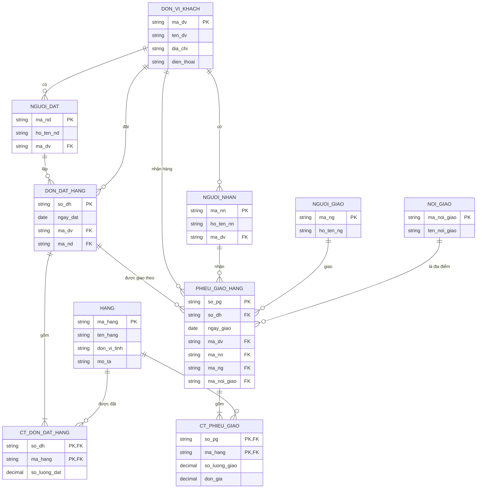

# ERD quản lý đơn đặt hàng

**Quy ước:** `PK` là khóa chính; `FK` là khóa ngoại. Hai khóa chính trong một bảng chi tiết tạo thành khóa chính ghép. `Thành tiền = số lượng giao × đơn giá`, nên tính khi hiển thị phiếu; tổng tiền là tổng thành tiền của các dòng.

Mô hình cho phép một đơn được giao qua nhiều phiếu. Nếu bài tập quy định mỗi đơn chỉ có đúng một phiếu giao, đổi quan hệ giữa `DON_DAT_HANG` và `PHIEU_GIAO_HANG` thành một-một và đặt ràng buộc duy nhất cho `PHIEU_GIAO_HANG.so_dh`.
